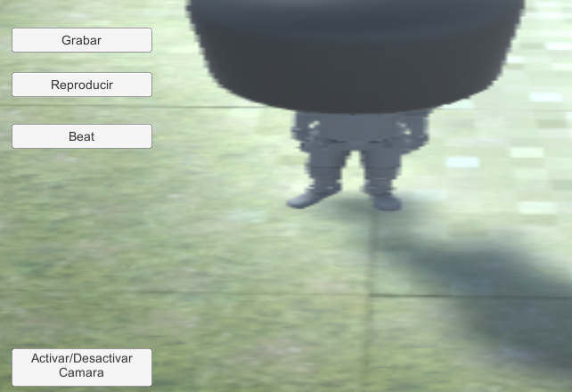
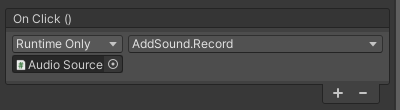
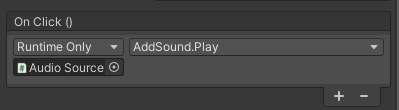
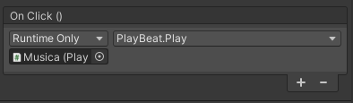
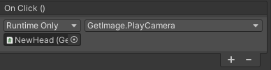

# Practica 4 de Interfaces Inteligentes. Cámara y Micrófono.

## **Autor**: Francisco Jesus Mendes Gomez.

## **Índice:**  

1. [**Ejecución**](#id1)
2. [**Scripts e Implementación**](#id2)   

## 1. Ejecución

La aplicación desarrollada, es una especie de karaoke donde podremos rapear sobre una pista de trap, a través de la interfaz de usuario podemos observar varias opciones:

1. La opción de `Grabar` empezará a grabar nuestra entrada por el microfono hasta que le vuelvas dar al boton para parar la grabación.  
   
2. La opción `Reproducir` reproduce la última grabación que tengamos almacenada. 

3. La opción `Beat` pondrá a sonar una pista de audio perteneciente a una base de trap sobre la cual podremos rapear.  

4. Por último la opción `Activar/Desactivar Cámara` activa o pausa la captura de la webcam del dispositivo cuya imagen será ser visualizada en la cabaza de nuestro personaje dentro de la aplicación.  

Resultado:

## 2. Scripts e Implementación

+ Para capturar la entrada del microfono creamos el objeto Microphone el cual posee un objeto hijo tipo Audio Source el cual posee el script `AddSound.cs` el cula tiene las funciones Record() y Play() las cuales están vinculadas al onClick() de los botones `Grabar` y `Reproducir` respectivamente como veremos en las siguientes capturas.

  + Para el botón `Grabar`
  
  

  + para el botón `Reproducir` 

  

Podemos observar que en ambos casos en objeto que pasamos es el Audio Source que es hijo de Microphone pero cambia la función la cual se llama que se encuentran dentro del script `AddSound.cs`.

+ En el botón `Beat` su función onclick referencia al objeto Musica que contiene tanto el archivo con la pista a utilizar como el script `PlayBeat.cs`, que contiene la funcion Play() que reproducir la pista desde el principio o detiene su reproducción.

  

+ En el botón `Activar/Desactivar Cámara` su función onClick referencia al objeto NewHead que contiene al script `GetImage.cs` que recoge la información de la camara web y la renderiza sobre el objeto NewHead. onClick haría una llamada a la función PlayCamera() para activar o pausar la cámara.

  

+ Tenemos el script `FollowPlayer.cs` en el objeto CameraWall1 que la camar siga al jugador desde una distancia dada por páramtros y poder rotar esta cámara al rededor del jugador con el movimiento horizontal del ratón.

+ El script `HeadOfEthan.cs` se encunentra en objeto NewHead para variar su posición y se convierta en la nueva cabeza del jugador.

+ `GameController.cs` es el script con el controlador de escena en este caso esta definido pero no hace falta pero lo he creado por si queria añadir eventos a la aplicación y puede ser útil luego para añadir funcionalidades.

+ Por último tenemos el script `FirstPersonCamera.cs` que se encuntra en el objeto Main Camera la cual posiciona la cámara en una vista en primera persona del jugador.
